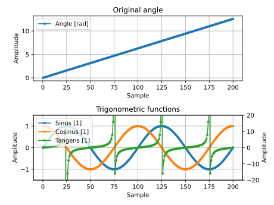

# CsvPlotter

A simple to use script to plot CSV files using [matplotlib](https://matplotlib.org/).

Additionally to the ability to plot CSV files a selection of utility functions operating on CSV files.

## Current Features

### Plotting

The plotting part of the script already supports a good range of features. The following functionality can be accessed
with command line arguments:

- Selectively plot columns. This allows plotting any combination of columns.
- Reducing the amount of plotted samples by taking every n-th sample or specifying a range of samples to plot.
- Exporting the plot as a an image file supported by `matplotlib` without the need for a GUI.

When working with YAML configuration files the range supported features is even broader:

- Setting default filename for the date file and the exported image file.
- Group columns into subplots which allows for less cluttered, more readable plots.
- Setting titles for subplots, labels for X and Y axes as well as legend texts for each plotted column.
- Move columns to alternative Y axes in their subplots which allows for pretty diverse data to be plotted in the same subplot, since both Y axes scale independently.
- Set the scale of both Y axes independently when the automatic scaling does not deliver a reasonable result.

### Utility Functions

By now, only one utility function is implemented which lists all column headers in order of appearance. This is useful if you want to plot a CSV file but do not remember the exact spelling of each column header.

## (Maybe) Future Features

- Provide a way to set the line style and color for each separate column independently.
- Implement utility functions for basic file transformations like:
  - Skipping the first N lines of a file and dropping the last M as well. This would allow to plot CSV data which is embedded in a larger file.
  - Some kind of interface to derive additional columns based on already existing ones (I do not know how this should look like atm...).
- Specifying the CSV separator character.
- TBD.

## Installation

By now, the package is not yet published to the official PyPi. If you already want to use it you can install the package directly:

1. Clone this repo \
   `git clone git@github.com:skaupper/CsvPlotter`
2. Install the required packages\
   `python3 -m pip install setuptools`
3. Install the package using *setuptools*\
   `python3 setup.py install`

Alternatively you can install the latest version from the Test PyPi using for example pip:
`pip install --index-url https://test.pypi.org/simple/ csv-plotter-skaupper`

## Usage

By installing the package two scripts are provided:
`csv_util` for the utility functions and `csv_plot` for everything plotting related.

By now `csv_util` only lists column headers which can be done with `csv_util -l angle_data.csv`.

### How to Plot

The plotting script is a little bit more sophisticated by providing command line arguments as well as a configuration file format for access to the more advanced features and easy to reproduce plots.

#### Command Line Arguments

Only very basic features are available via command line arguments.

```bash
    csv_plot -i angle_data.csv -o angle_data.svg -d 3 -r 10:100 sin cos
```

The command above takes the file `angle_data.csv` as input and exports the resulting plot as `angle_data.svg`. The actual output format is determined automatically and follows the rules of [`matplotlib.pyplot.savefig`](https://matplotlib.org/3.1.1/api/_as_gen/matplotlib.pyplot.savefig.html). If the output file is omitted an interactive plot is opened using [`matplotlib`](https://matplotlib.org/).

The parameters `-r` and `-d`  are used to reduce the amount of data points to plot:

- `-r` allows to specify a range of data samples which should be considered for plotting. This flag expects an argument of the format `[START]:[END]` (inclusive `START`, exclusive `END`) where omitting `START` resp. `END` would consider all samples from the given start sample resp. to the given end sample. Passing only `:` delivers the same result as omitting the whole `r` flag.
- `-d` is used to divide the sample count by a constant factor. Passing for example the number 3 would only consider every 3rd sample for plotting.

All positional arguments passed to the `csv_plot` commands are considered column names (resp. column indices starting at 0) which should be plotted.

#### Configuration File

By passing the flag `-c` with the path to a configuration file the script parses the file and tries to configure the plotting according to the settings specified.

This configuration file is generally separated into a general plot config, at least one subplot config and at least one column config for each of the specified subplots. In the YAML file this hierarchy is represented as nested lists.

An example configuration as well as short descriptions for all used fields are given below:

```yaml
# A value of ~ is considered a null value in YAML!
---
input_file: angle_data.csv      # Path to data file.    Required
output_file: angle_data.svg     # Image export path.    Optional (Default: ~)
xlim: [~, 100]                  # Sample range to plot. Optional (Default: ~)
divider: 1                      # Divider value.        Optional
share_x_axis: true              # Share the X axis
                                # between subplots.     Optional (Default: true)

plots:
  - title: Original angle       # Title of the subplot. Optional (Default: ~)
    ylabel: Amplitude           # Label for the Y axis. Optional (Default: 'Y')
    xlabel: Sample              # Label for the X axis. Optional (Default: 'X')
    columns:                    # A list of columns.    Required (at least 1)
      - name: angle             # Name of the column.   Required.
        label: Angle [rad]      # Label for the column. Optional (Default: `name`)
  - title: Trigonometric functions
    ylabel: Amplitude
    alt_ylabel: Amplitude       # Label of 2nd Y axis.  Optional (Default: ~)
    xlabel: Sample
    columns:
      - name: sin
        lable: Sinus [1]
      - name: cos
        lable: Cosinug [1]
      - name: tan
        lable: Tangens [1]
        alt_y_axis: true        # Plot this column on
                                # the 2nd Y axis.       Optional (Default: false)
```

Executing the command `csv_plot -c angle_data_cfg.yml` in the `doc/` directory will result in the following plot:


